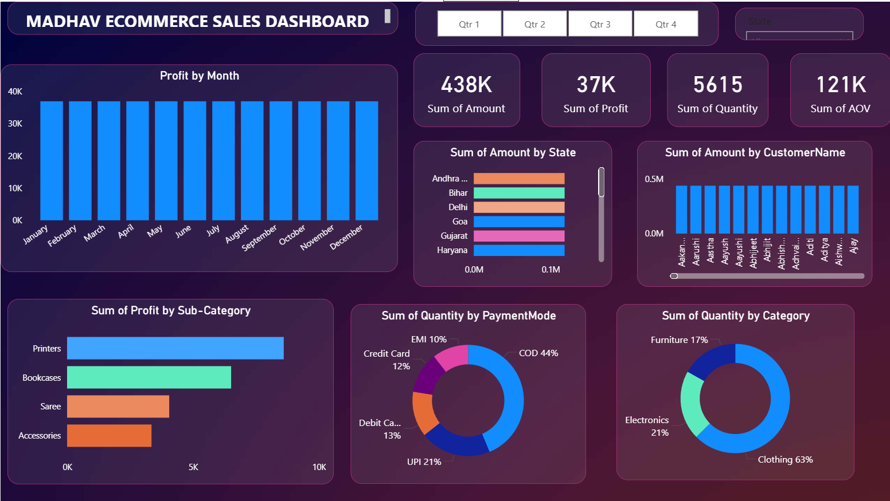

# Power BI Projects

This repository contains my Power BI dashboards created as part of my data analytics learning journey.

---

## Project 1: Madhav Ecommerce Sales Dashboard

**File:** `project 1.pbix`

### 🔹 Project Overview
The **Madhav Ecommerce Sales Dashboard** is designed to analyze ecommerce sales performance across different dimensions such as time, state, category, payment mode, and customers.  
The dashboard helps in understanding business trends and key performance indicators (KPIs).

---

### 🔹 Key KPIs
- Total Sales Amount
- Total Profit
- Total Quantity Sold
- Average Order Value (AOV)

---

### 🔹 Dashboard Insights
- Monthly profit analysis
- Sales performance by state
- Top customers by sales amount
- Profit by product sub-category
- Quantity distribution by payment mode
- Quantity distribution by product category
- Quarterly sales analysis using slicers

---

### 🔹 Data Cleaning & Transformation
- Cleaned raw CSV data using **Power Query**
- Fixed mixed date formats (DD-MM-YYYY & MM-DD-YYYY)
- Removed errors and handled null values
- Ensured correct data types for analysis

---

### 🔹 Tools & Technologies Used
- Power BI Desktop
- Power Query Editor
- CSV Dataset
- GitHub

---

### 🔹 Skills Demonstrated
- Data Cleaning & Transformation
- Handling date format issues
- Data modeling
- KPI creation
- Interactive dashboard design
- GitHub project documentation

---

📌 *This project demonstrates my ability to clean data, build insightful dashboards, and present business-ready analytics using Power BI.*
